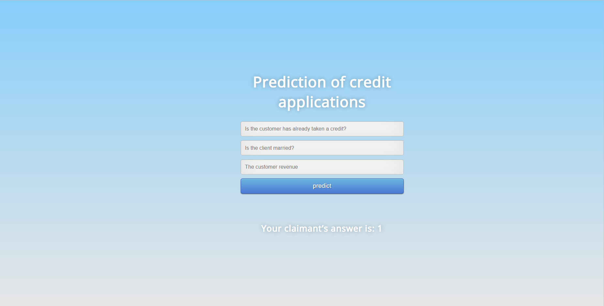

## ML-Model-Flask-Deployment
This is a demo project to elaborate how Machine Learn Models are deployed on production using Flask API

### Prerequisites
You must have Scikit Learn, Pandas (for Machine Leraning Model) and Flask (for API) installed.

### Project Structure
This project has four major parts :
1. model.py - This contains code fot our Machine Learning model to predict customer loan status absed on trainign data in 'customer.csv' file.
2. app.py - This contains Flask APIs that receives customer details through GUI or API calls, computes the precited value based on our model and returns it.
3. request.py - This uses requests module to call APIs already defined in app.py and dispalys the returned value.
4. templates - This folder contains the HTML template to allow user to enter customer detail and displays the predicted loan status.

### Running the project
1. Ensure that you are in the project home directory. Create the machine learning model by running below command -
```
python model.py
```
This would create a serialized version of our model into a file model.pkl

2. Run app.py using below command to start Flask API
```
python app.py
```
By default, flask will run on port 5000.

3. Navigate to URL http://localhost:5000


You should be able to view the homepage as below:
 
Enter valid numerical values in all 3 input boxes and hit Predict.

If everything goes well, you should  be able to see the predcited loan status vaule on the HTML page!


4. You can also send direct POST requests to FLask API using Python's inbuilt request module
Run the beow command to send the request with some pre-popuated values -
```
python request.py
```
